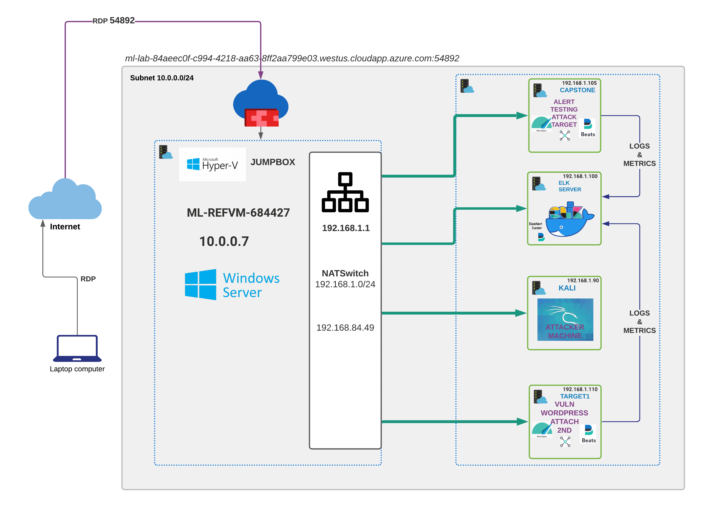
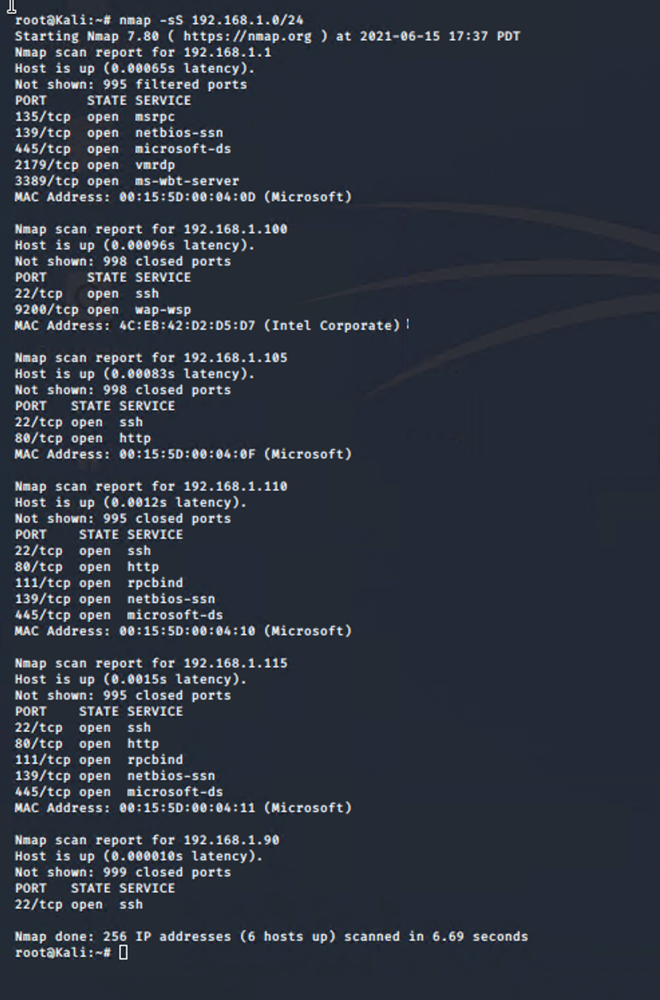
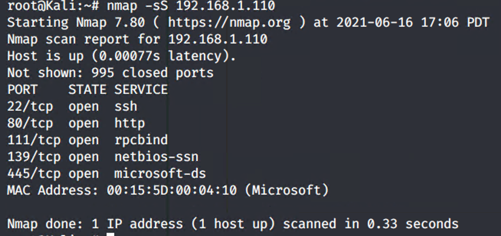
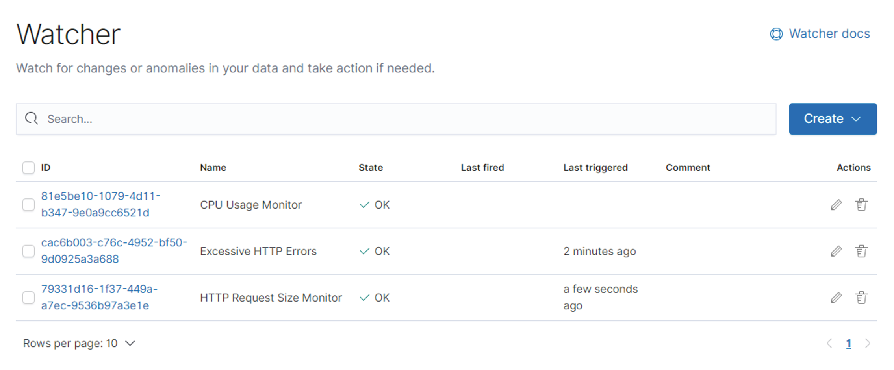
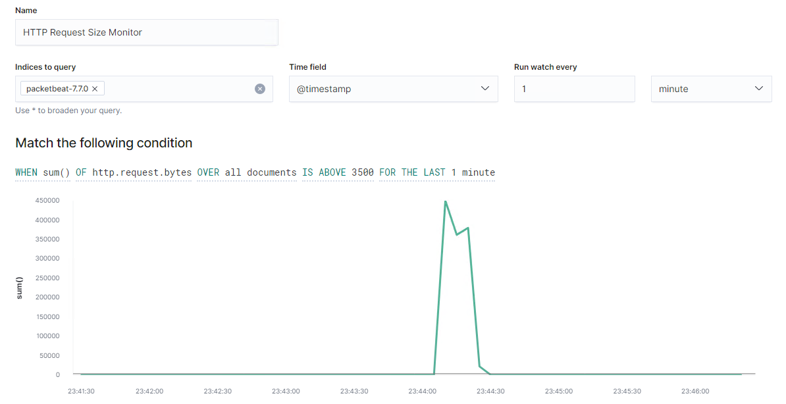
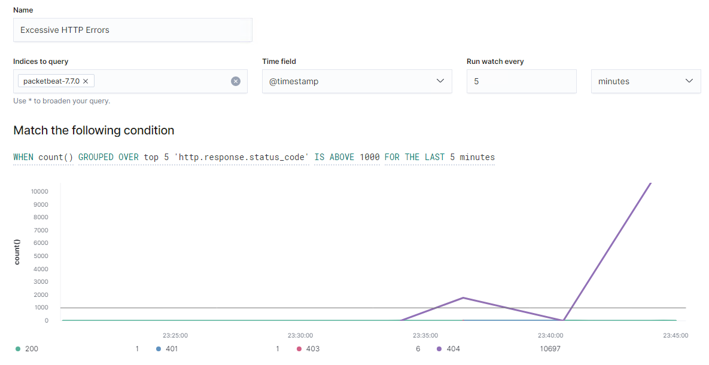
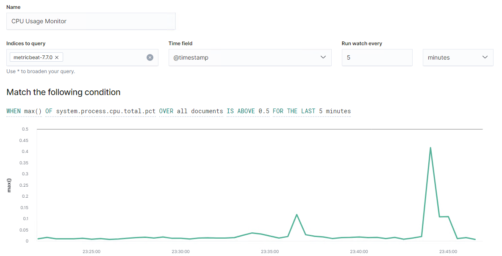

# Blue Team: Summary of Operations

## Table of Contents
- Network Topology
- Description of Targets
- Monitoring the Targets
- Patterns of Traffic & Behavior
- Suggestions for Going Further

### Network Topology

### 

The following machines were identified on the network:
- **ML-REFVM-684427**
  
  - **Operating System**: Windows 10 Pro
  - **Purpose**: Bastion Host / Jumpbox
  - **IP Address**: 10.0.0.7 / 192.168.84.49
- **ELK**
  
  - **Operating System**: Ubuntu 18.04.4 LTS
  - **Purpose**: Setup Alert and Monitoring Traffic
  - **IP Address**: 192.168.1.100/24
- **Target1**
  
  - **Operating System**: Debian GNU/Linux 8
  - **Purpose**: Vuln WordPress - Compromised System
  - **IP Address**: 192.168.1.110/24
- **Capstone**
  
  - **Operating System**: Ubuntu 18.04.4 LTS
  - **Purpose**: Alert Testing and Attack Target
  - **IP Address**: 192.168.1.105/24
- **Kali**
  
  - **Operating System**: Linux 5.4.0-KALI3-AMD64
  - **Purpose**: Pen Test Machine & Tools
  - **IP Address**: 192.168.1.90/24
- **Target2**
  
  - **Operating System**: Debian GNU/Linux 8
  - **Purpose**: Vulnerable Machine
  - **IP Address**: 192.168.1.115/24
  
  

### Description of Targets
The target of this attack was: `Target 1` (192.168.1.110/24).

Target 1 is an Apache web server and has SSH enabled, so ports 80 and 22 are possible ports of entry for attackers. As such, the following alerts have been implemented:

### Monitoring the Targets

Traffic to these services should be carefully monitored. 

* We attack

To this end, we have implemented the alerts below:

#### HTTP Request Size Monitor
HTTP Request Size Monitor is implemented as follows:
  - **Metric**: Sum of `http.request.bytes`
  - **Threshold**: 3500
  - **Vulnerability Mitigated**: Monitoring has been set to alert when the payloads are greater than 3500 bytes within a time frame (1 Minute) - POST exploit indicator.
  - **Reliability**: Possible false positives as we do not get a lot of data to indicate the type of request trying to access.  Depending on the POST request type and the required payload size, it may generate false positive.  This alert gives us an opportunity to build the baseline and continue to fine tune.
    

#### Excessive HTTP Errors
Excessive HTTP Errors is implemented as follows:
  - **Metric**: `http.response.status_code` - timestamp
  - **Threshold**: Sum is within top 5 group in the last 5 minutes
  - **Vulnerability Mitigated**: Monitoring has been set to alert when the sum of status_code of 400 in the last 5 minutes shows up in the top 5 count - Brute force HTTP password attacks.
  - **Reliability**: Medium.  Helps to establish the baseline and with more data, we will be able to ensure to differentiate attacks and solidify the threshold. 
    

#### CPU Usage Monitor
CPU Usage Monitor is implemented as follows:
  - **Metric**: Sum of `system.process.cpu.total.pct`

  - **Threshold**: CPU reaches to 50% in the last 5 minutes.

  - **Vulnerability Mitigated**: Monitoring ahs been set to alert when the cup tops 50% in the last 5 minutes - High resources utilization.

  - **Reliability**: Medium- This is a good indicator when combined with other alerts and data such as maintenance windows, patch update windows, and modifications windows that are perform on the system. These can generate false postive.

    

### Suggestions for Going Further (Optional)
The logs and alerts generated during the assessment suggest that this network is susceptible to several active threats, identified by the alerts above. In addition to watching for occurrences of such threats, the network should be hardened against them. The Blue Team suggests that IT implement the fixes below to protect the network:
- Vulnerability 1: SSH - CVE-2015-5600 - Remote attackers to conduct brute-force attacks or cause a denial of service (CPU consumption) via a long and duplicative list in the ssh
  - **Patch**: Update the patch from the vendor.
  - **Why It Works**: Because after the fix it only query each keyboard-interactive device once per authentication request regardless of how many times it is listed;
- Vulnerability 2: HTTP - CVE-2017-7668 - An attacker may be able to cause a segmentation fault, or to force ap_find_token() to return an incorrect value.
  - **Patch**: RHSA-2017:2479: httpd security update (Important)
  - **Why It Works**: The HTTP strict parsing changes added to prevent this vulnerability.
- Vulnerability 3: Samba SMBD - CVE-2007-2447 - Allows remote attackers to execute arbitrary commands by specifying a username containing shell meta characters.
  - **Patch**: A patch against Samba 3.0.24 has been posted.
  - **Why It Works**: The root cause is passing unfiltered user input provided via MS-RPC calls to /bin/sh when invoking externals scripts defined in smb.conf.  This has been fix in the later version.