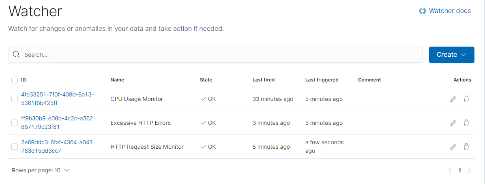

# Blue Team: Summary of Operations

## Table of Contents
- Network Topology
- Description of Targets
- Monitoring the Targets
- Patterns of Traffic & Behavior
- Suggestions for Going Further

### Network Topology

### 

The following machines were identified on the network:
- ML-REFVM-684427
  - **Operating System**: Windows 10 Pro
  - **Purpose**: Bastion Host / Jumpbox
  - **IP Address**: 10.0.0.7 / 192.168.84.49
- ELK
  - **Operating System**: Ubuntu 18.04.4 LTS
  - **Purpose**: Setup Alert and Monitoring Traffic
  - **IP Address**: 192.168.1.100/24
- Target1
  - **Operating System**: Debian GNU/Linux 8
  - **Purpose**: Vuln WordPress - Compromised System
  - **IP Address**: 192.168.1.110/24
- Capstone
  - **Operating System**: Ubuntu 18.04.4 LTS
  - **Purpose**: Alert Testing and Attack Target
  - **IP Address**: 192.168.1.105/24
- Kali
  - **Operating System**: Linux 5.4.0-KALI3-AMD64
  - **Purpose**: Pen Test Machine & Tools
  - **IP Address**: 192.168.1.90/24
- Target 2
  - **Operating System**: Debian GNU/Linux 8
  - **Purpose**: Vulnerable Machine
  - **IP Address**: 192.168.1.115/24
  
  

### Description of Targets
The target of this attack was: `Target 1` (192.168.1.110/24).

Target 1 is an Apache web server and has SSH enabled, so ports 80 and 22 are possible ports of entry for attackers. As such, the following alerts have been implemented:

### Monitoring the Targets

Traffic to these services should be carefully monitored. To this end, we have implemented the alerts below:

#### HTTP Request Size Monitor
HTTP Request Size Monitor is implemented as follows:
  - **Metric**: `http.request.bytes`
  - **Threshold**: 3500
  - **Vulnerability Mitigated**: Monitoring has been set to alert when the payloads are greater than 3500 bytes within a time frame (1 Minute).
  - **Reliability**: TODO: Does this alert generate lots of false positives/false negatives? Rate as low, medium, or high reliability.

#### Excessive HTTP Errors
Excessive HTTP Errors is implemented as follows:
  - **Metric**: `http.response.status_code`
  - **Threshold**: Sum is within top 5 group in the last 5 minutes
  - **Vulnerability Mitigated**: Monitoring has been set to alert when the sum of status_code of 400 in the last 5 minutes shows up in the top 5 count.
  - **Reliability**: TODO: Does this alert generate lots of false positives/false negatives? Rate as low, medium, or high reliability.

#### CPU Usage Monitor
CPU Usage Monitor is implemented as follows:
  - **Metric**: `system.process.cpu.total.pct`
  - **Threshold**: CPU reaches to 50% in the last 5 minutes.
  - **Vulnerability Mitigated**: Monitoring ahs been set to alert when the cup tops 50% in the last 5 minutes.
  - **Reliability**: TODO: Does this alert generate lots of false positives/false negatives? Rate as low, medium, or high reliability.

### Suggestions for Going Further (Optional)
_TODO_: 
- Each alert above pertains to a specific vulnerability/exploit. Recall that alerts only detect malicious behavior, but do not stop it. For each vulnerability/exploit identified by the alerts above, suggest a patch. E.g., implementing a blocklist is an effective tactic against brute-force attacks. It is not necessary to explain _how_ to implement each patch.

The logs and alerts generated during the assessment suggest that this network is susceptible to several active threats, identified by the alerts above. In addition to watching for occurrences of such threats, the network should be hardened against them. The Blue Team suggests that IT implement the fixes below to protect the network:
- Vulnerability 1
  - **Patch**: TODO: E.g., _install `special-security-package` with `apt-get`_
  - **Why It Works**: TODO: E.g., _`special-security-package` scans the system for viruses every day_
- Vulnerability 2
  - **Patch**: TODO: E.g., _install `special-security-package` with `apt-get`_
  - **Why It Works**: TODO: E.g., _`special-security-package` scans the system for viruses every day_
- Vulnerability 3
  - **Patch**: TODO: E.g., _install `special-security-package` with `apt-get`_
  - **Why It Works**: TODO: E.g., _`special-security-package` scans the system for viruses every day_