# Network Forensic Analysis Report

## Time Thieves 

You must inspect your traffic capture to answer the following questions:

1. What is the domain name of the users' custom site?

   1. frank-n-td.com
      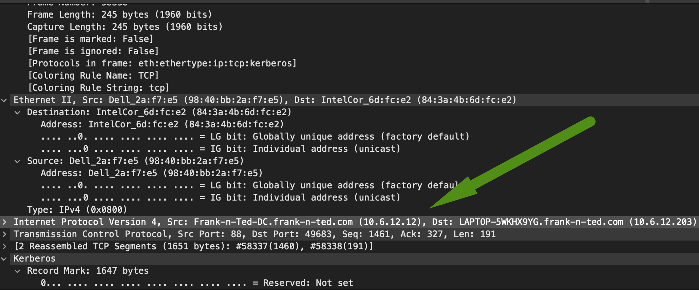

2. What is the IP address of the Domain Controller (DC) of the AD network?

   1. 10.6.12.12
      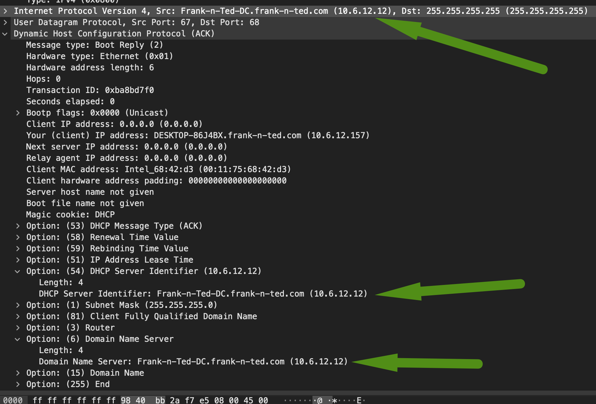

3. What is the name of the malware downloaded to the 10.6.12.203 machine?
   

   - 10.6.12.203 Machine Details:

     - Host name: LAPTOP-5WKHX9YG
     - IP address: 10.6.12.203
     - MAC address: IntelCor_6d:fc:e2 (84:3A:4B:6D:FC:E2)
     - Username details:
       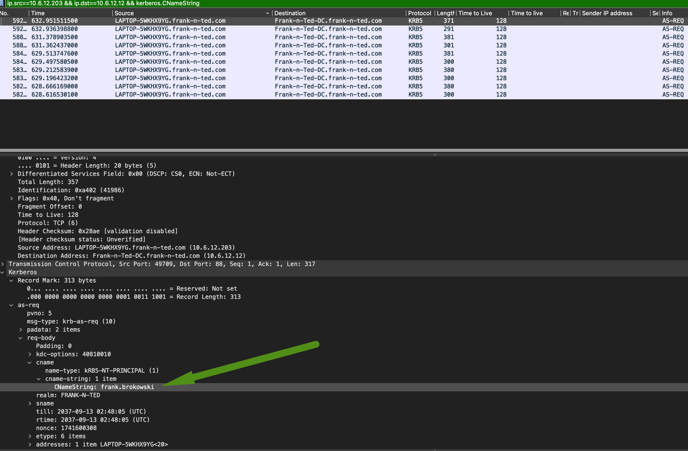
   
   - Once you have found the file, export it to your Kali machine's desktop.
   
     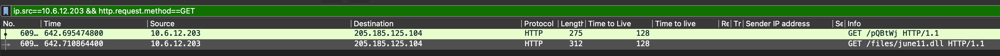
   
     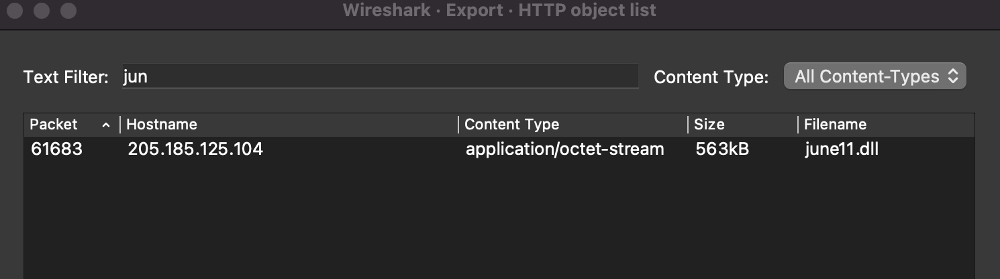
   
     
   
4. Upload the file to [VirusTotal.com](https://www.virustotal.com/gui/). 

   1. 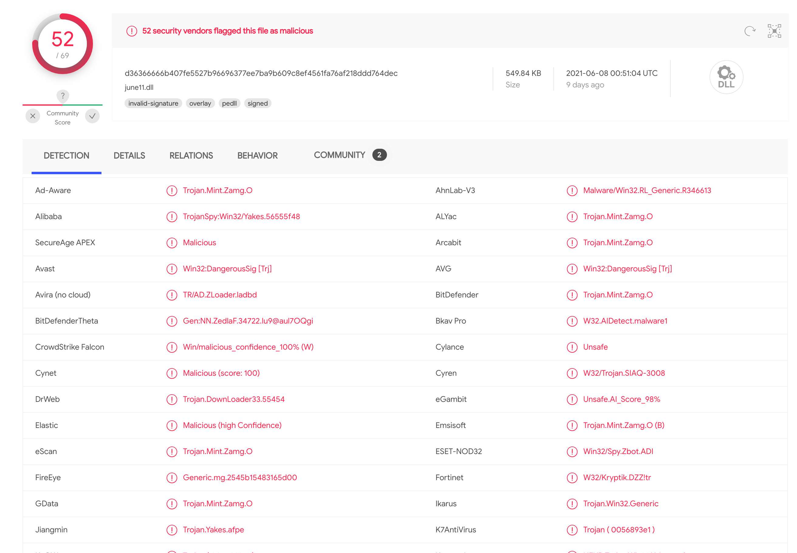

5. What kind of malware is this classified as?

   1. 52 out of 69 vendors have flagged this malicious file as **Trojan horse** with most of the with high confidence.

## Vulnerable Windows Machine - 172.16.4.

1. Find the following information about the infected Windows machine:

   - Host name: Rotterdam-PC

   - IP address: 172.16.4.205

   - MAC address: LenovoEM_b0:63:a4 (00:59:07:B0:63:A4)

     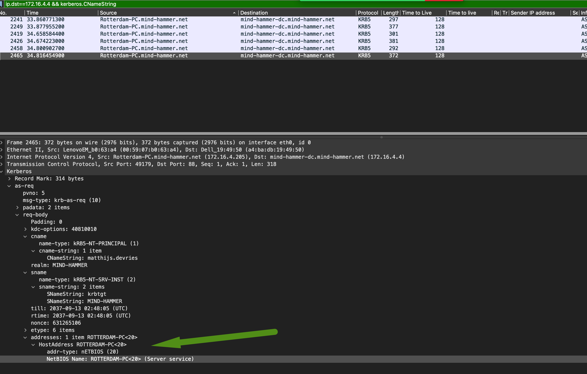

2. What is the username of the Windows user whose computer is infected?

   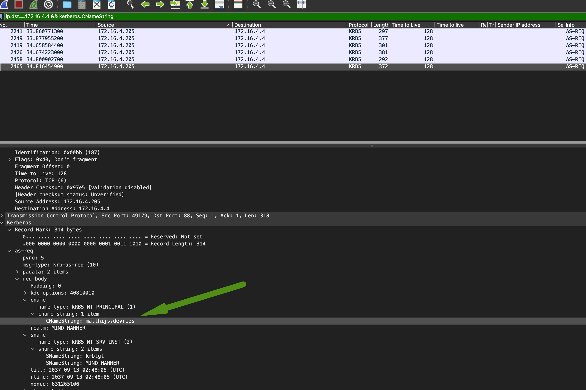

   1. `matthijs.devries`

3. What are the IP addresses used in the actual infection traffic?

   

   1. 205.185.125.104

   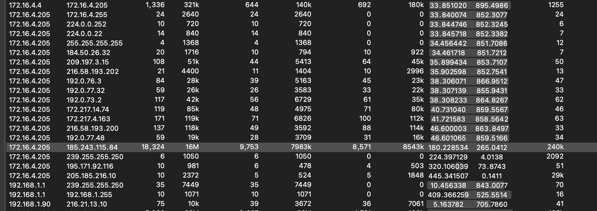

   **When we compare to other downloaded file, this files stands out as anomaly.** 

4. As a bonus, retrieve the desktop background of the Windows host.

   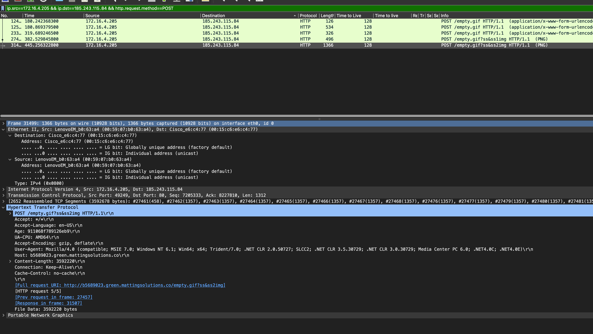

---

## Illegal Downloads

1. Find the following information about the machine with IP address `10.0.0.201`:
    - MAC address: 00:16:17:18:66:c8
    - Windows username: elmer.blanco
    - OS version: Windows 10

    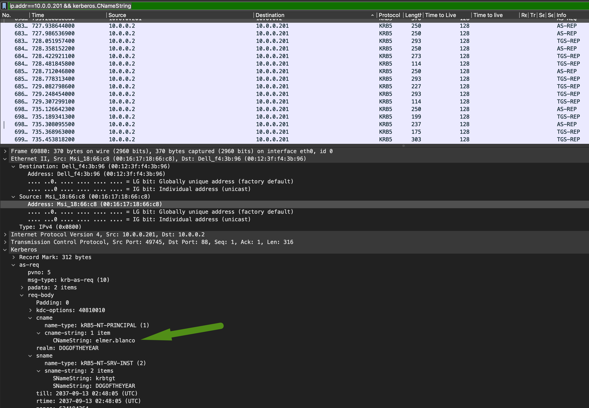
    
    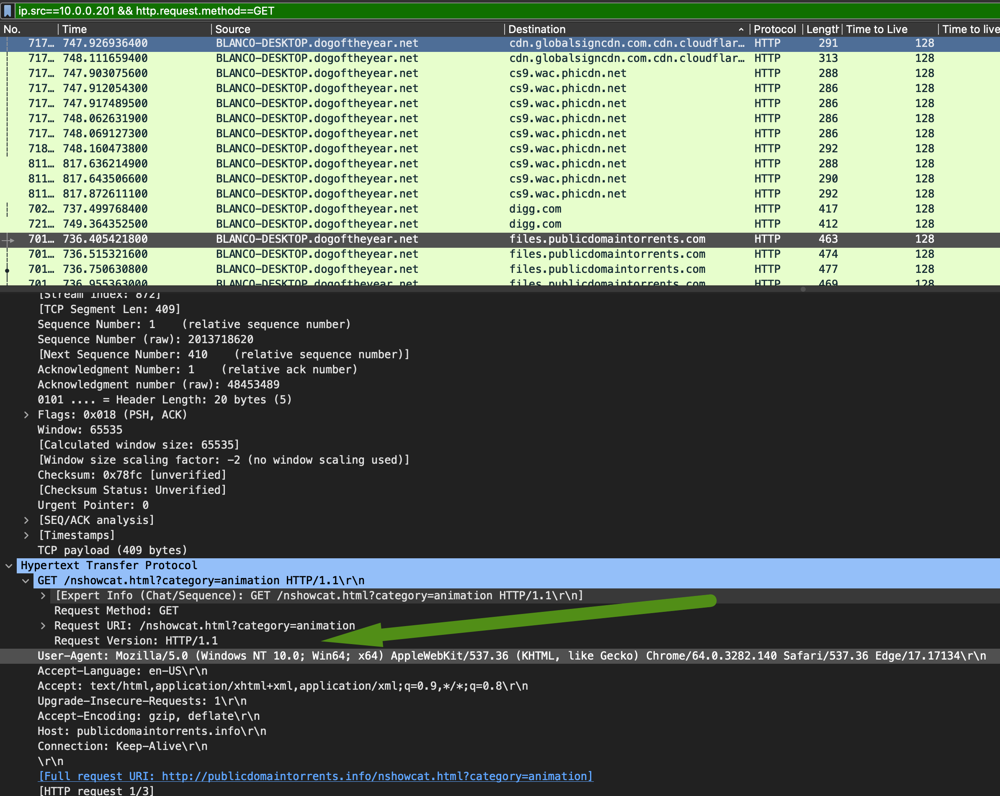
    
2. Which torrent file did the user download?

    1. `Betty_Boop_Rhythm_on_the_Reservation.avi.torrent`
        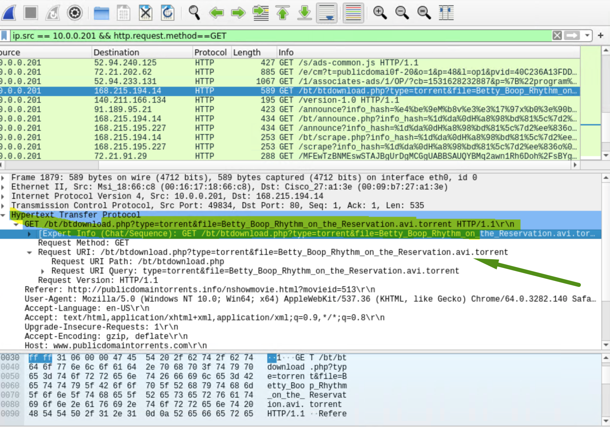

    